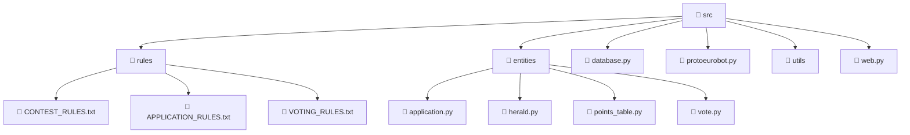

# ProtoeuroBot

Телеграм бот, позволяющий реализовать симулятор Евровидения.

Конкурс делится на 2 стадии: подачу заявок и голосование. Команда `/help` описывает все доступные пользователю команды на каждой стадии конкурса. Команда `/admin_help`, которая становится доступной после добавления вашего telegram id в `RAW_ADMIN_IDS`, позволяет ознакомиться с админскими командами для просмотра чужих заявок, рассылки сообщений участникам, удобной генерации таблиц с текущими результатами конкурса, и так далее.

## Структура репозитория



1. `rules` содержит правила контеста, которые смогут увидеть участники. В файлах содержатся ограничения по умолчанию.
2. `database` - реализация базы данных на основе `aiosqlite` и запросов через `pypika`.
3. `protoeurobot` - логика взаимодействия API telegram, реализована через `aiogram` и `asyncio`.
4. `web` - получение и обработка клипов для песен с YouTube через `aiohttp`.
5. `entities` - сущности и их вспомогательные методы, используемые в боте.
6. `utils` - вспомогательные методы.

## Использование

### Установка

```bash
uv pip install -e protoeuro_bot --force-reinstall
```

### Запуск
```
python protoeurobot.py
```

## Авторы
[Святослав Белкин](https://github.com/M3VV0)
